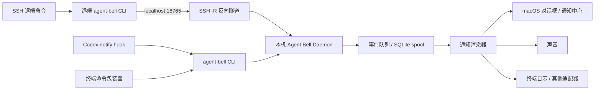

# Agent Bell 架构设计

## 1. 目标与设计原则

Agent Bell 是一个本机常驻的“完成事件接收器”。Codex、普通终端命令以及 SSH 远端命令在完成时发送一个统一事件，接收器负责确认事件、排队并在目标机器上发出提醒。

设计目标：

- 用户可以用一个很短的命令前缀包住任意终端命令。
- Codex 可以通过原生 `notify` hook 一键接入。
- 远端 SSH 机器无需开放入站端口，可以通过 SSH 反向隧道发送到本机。
- 本机和远端都可以运行接收器并发出提醒。
- 发送方不需要等待弹窗关闭；提醒失败也不应改变原命令的退出码。
- 默认只监听回环地址，并用 token 保护事件接口。

不在第一版解决的事情：跨设备账号同步、云端消息中心、复杂的任务历史 UI，以及保证机器断电场景下的绝对不丢失。

## 2. 总体架构



组件职责：

| 组件 | 职责 |
| --- | --- |
| `agent-bell` CLI | 发送事件、包装命令、检查守护进程状态、初始化配置 |
| Agent Bell Daemon | 提供 HTTP 接口、校验请求、去重、入队、调度通知 |
| Event Queue | 让 HTTP 接口快速返回；短暂离线时保存待处理事件 |
| Notification Renderer | 根据配置播放声音、显示 macOS 弹窗或终端提醒 |
| Codex Adapter | 将 Codex 原生 hook 的输入转换为统一事件 |
| SSH Adapter | 使用反向隧道把远端的本地请求送到运行通知的机器 |

## 3. 统一事件模型

所有来源都转换为同一个事件，避免 Daemon 为 Codex、Shell、SSH 分别维护协议。

```json
{
  "event_id": "01J...",
  "source": "codex|command|agent|custom",
  "status": "success|failure|cancelled|unknown",
  "title": "Agent Bell",
  "message": "Agent finished",
  "command": "pytest -q",
  "host": "workstation",
  "cwd": "/Users/me/project",
  "started_at": "2026-09-19T03:41:00Z",
  "finished_at": "2026-09-19T03:42:10Z",
  "exit_code": 0,
  "metadata": {}
}
```

字段规则：

- `event_id` 由发送方生成，重试时保持不变；Daemon 以它做幂等去重。
- `source` 和 `status` 是枚举，未知值保留为 `unknown`，不能导致请求失败。
- `command`、`cwd` 和 `metadata` 可选，默认截断长度，避免把秘密或超大输出写入日志。
- 时间统一使用 ISO 8601 UTC；Daemon 可补齐缺失的 `finished_at`。

## 4. Daemon 接口

### 4.1 事件接口

`POST /v1/events`

请求头：

```http
Content-Type: application/json
Authorization: Bearer <token>
```

响应：

- `202 Accepted`：事件已进入队列。
- `200 OK`：事件已被此前的请求处理过，按 `event_id` 去重。
- `400 Bad Request`：JSON 或必填字段无效。
- `401 Unauthorized`：token 不正确。
- `429 Too Many Requests`：超过限流，发送方按退避策略重试。

Daemon 不在请求线程里等待 `osascript` 或声音播放结束。队列成功写入后立即返回 `202`。

### 4.2 运维接口

- `GET /healthz`：进程存活检查，不要求 token，只绑定回环地址。
- `GET /readyz`：配置和队列可写时返回 `200`。
- `POST /v1/test`：用当前配置发出测试提醒，需要 token，供安装向导验证。

## 5. 终端命令接入

推荐用户体验：

```bash
abll run -- npm test
abll run -- python train.py
```

`run` 的行为：

1. 记录开始时间并启动后面的命令。
2. 原样转发 stdin、stdout、stderr 和信号。
3. 命令退出后读取退出码，生成 `source=command` 事件。
4. 尝试发送事件，最多重试数次。
5. 返回原命令的退出码。

这样提醒发送失败不会掩盖测试或构建本身的结果。对于希望保留当前命令写法的用户，可以在 shell 中提供可选别名：

```bash
abll run -- npm test
```

第一版不建议通过 `eval` 解析整段字符串；参数应使用 argv 传递，避免引入额外的 shell 注入和转义问题。

## 6. Codex 接入

Codex 原生提供 `notify` hook，因此不需要轮询 Codex 进程，也不需要修改 Codex 本身。`agent-bell codex setup` 执行以下步骤：

1. 检查 `agent-bell daemon` 是否运行，未运行则安装并启动用户级服务。
2. 生成或复用本机 token。
3. 写入 Codex 的 `notify` 配置，使其调用 `agent-bell codex-hook`；如果已有其他 `notify`，默认保留并提示冲突。
4. `codex-hook` 从 stdin 或环境变量读取 hook payload，提取完成状态和摘要。
5. 转换为 `source=codex` 事件并发送到本机 `/v1/events`。
6. 提供 `agent-bell codex setup --check` 只读验证配置；需要覆盖已有配置时使用 `--force`，旧配置会先备份。

Hook 适配器需要容忍字段变化：不能把某一个 Codex payload 的完整结构写死为公共协议。原始 payload 仅用于 `metadata`，并限制大小。

## 7. SSH 远端接入

### 7.1 推荐拓扑：反向隧道

本机 Daemon 监听 `127.0.0.1:18765`。远端通过以下方式把远端回环端口映射到本机 Daemon：

```bash
ssh -N -T \
  -R 18765:127.0.0.1:18765 \
  user@remote-host
```

远端命令完成后，远端的 `agent-bell` CLI 请求 `http://127.0.0.1:18765/v1/events`。SSH 将该请求转发到本机，因此本机不需要暴露公网端口，也不需要在远端复制 macOS 弹窗能力。

### 7.1.1 CLI 配置

本机启动 Daemon 后，可以用以下命令完成远端 token 配置和隧道管理：

```bash
abll start
abll ssh setup user@remote-host
abll ssh connect user@remote-host
abll ssh status user@remote-host
```

SSH 服务使用非默认端口时，增加 `--ssh-port`：

```bash
abll ssh connect --ssh-port 6269 root@114.111.28.42
```

`ssh setup` 会通过 SSH 在远端创建 `~/.config/agent-bell/token` 和配置文件，并复制本机事件 token。`ssh connect` 在后台运行带 `ExitOnForwardFailure=yes` 的反向隧道，将远端 `127.0.0.1:18765` 映射到本机 Daemon。连接建立后，远端只要安装 Agent Bell，就可以执行：

也可以使用一条命令完成上述步骤：

```bash
abll ssh configure user@remote-host
```

该命令将每个步骤写入本机 state 目录的 checkpoint 文件。SSH 配置失败会有限次退避重试，重新执行命令会跳过已完成的配置步骤；隧道由监督进程运行，连接断开后会自动重连。

```bash
abll run -- pytest -q
```

完成事件会发送到远端回环地址，再通过隧道进入本机，最终由本机播放声音并弹窗。隧道管理命令为 `abll ssh disconnect user@remote-host`。

实际部署应使用独立的 SSH 配置项或 systemd/launchd 守护进程维持隧道，并设置 `ExitOnForwardFailure=yes`。隧道断开时 CLI 使用有限重试并记录可读错误。

### 7.2 远端也需要提醒时

远端可单独运行一个 Daemon，绑定自己的回环地址并使用自己的通知适配器（例如终端、Linux 桌面通知或声音）。事件发送目标由配置决定：

- `destination: local`：走 SSH 反向隧道，提醒本机。
- `destination: remote`：直接发给远端 Daemon。
- `destination: both`：发送两个目标；使用同一 `event_id`，各目标独立去重。

## 8. 配置设计

默认配置文件：`~/.config/agent-bell/config.yaml`。

```yaml
server:
  host: 127.0.0.1
  port: 18765
  token_file: ~/.config/agent-bell/token

notifications:
  sound: true
  popup: true
  popup_style: dialog       # dialog | notification
  title: Agent Bell
  success_message: "任务完成"
  failure_message: "任务失败"

delivery:
  timeout_seconds: 2
  retries: 3
  queue_file: ~/.local/state/agent-bell/events.db

destinations:
  local:
    url: http://127.0.0.1:18765
```

敏感 token 单独存储，权限设为 `0600`，不放入 shell history、命令参数或事件日志。配置命令应提供交互式初始化：`abll init`。

## 9. 队列、可靠性与并发

- 接收器使用线程或 asyncio 接受并发请求；通知渲染在独立 worker 中执行。
- SQLite spool 保存 `received`、`notified`、`failed` 状态和重试次数。单机开发版也可以先使用内存队列，但默认架构按 SQLite 设计。
- 同一 `event_id` 只产生一次提醒；事件正文不同也不覆盖已处理记录。
- 通知失败按指数退避重试，达到上限后保留失败记录并写入日志。
- 队列设置最大条数和事件 TTL，避免异常客户端填满磁盘。
- Daemon 关闭时先停止接收新任务，再等待 worker 在短超时内完成；超时事件保留在 spool 中。

## 10. 安全边界

- 默认只绑定 `127.0.0.1`，不直接接受局域网或公网流量。
- 所有事件接口要求 Bearer token；`healthz` 只返回有限状态信息。
- SSH 端口转发是信任边界，token 仍然保留，防止本机其他进程伪造事件。
- 对 `title`、`message`、`command` 和 `cwd` 做长度限制及控制字符清理，避免终端注入和异常弹窗。
- 日志默认不记录 token、完整命令输出或原始 hook payload。
- macOS 弹窗由当前登录用户的 launchd 用户服务运行，避免以 root 身份启动 GUI 进程。

## 11. 进程与安装生命周期

推荐命令面向用户隐藏实现细节：

```text
abll init                     创建配置、token 和用户级服务
abll start                    后台启动本机接收器
abll stop                     停止本机接收器
abll status                   查看运行状态和监听地址
abll daemon                   前台运行本机接收器（调试用）
abll test                     发送测试提醒
abll codex-hook               接收 Codex notify payload
abll run -- <command>         包装任意终端命令
```

macOS 使用 launchd LaunchAgent 自动启动并在用户登录后运行；不使用 root LaunchDaemon。安装、卸载和升级都应保持配置文件与 token 不变，除非用户明确要求重置。

## 12. 从当前 demo 迁移

当前 `demo.py` 已经验证了最小闭环：HTTP `POST /ding`、`afplay` 和 `osascript`。演进顺序如下：

1. 把 `/ding` 兼容为旧接口，内部转换成 `source=custom` 的统一事件。
2. 增加 `/v1/events`、Bearer token 和 JSON 校验。
3. 将弹窗、声音逻辑移动到通知渲染器 worker。
4. 增加 `abll run` CLI，保留原命令退出码。
5. 增加 SQLite spool、幂等和重试。
6. 增加 `codex-hook` 与 `codex setup`。
7. 增加 launchd 安装及 SSH 隧道配置向导。

每一步都可以独立运行，便于先把“终端命令完成提醒”发布，再加入 Codex 和远端能力。

## 13. 验证策略

最小验收场景：

1. `agent-bell test` 能在本机播放声音并弹窗。
2. `abll run -- sh -c 'exit 0'` 返回 0 并产生成功提醒。
3. `abll run -- sh -c 'exit 7'` 返回 7 并产生失败提醒。
4. 同一个 `event_id` 重发不会出现两个弹窗。
5. Daemon 重启后，spool 中未完成事件仍能被处理。
6. SSH 反向隧道建立后，远端命令可以在本机收到提醒；隧道断开时命令退出码不被改变。
7. Codex hook setup 检查通过，Codex 完成一次执行后能产生 `source=codex` 事件。

测试应优先使用假的通知渲染器和临时 SQLite 文件；macOS GUI 弹窗只在端到端测试中启用。

## 14. 开发环境

项目使用 `uv` 管理 Python 虚拟环境和锁文件，不依赖全局 Python 包。首次准备环境：

```bash
uv sync
uv run python -m agent_bell --help
```

也可以直接使用项目根目录的 `./abll` 包装命令；它会自动通过 `uv run` 使用项目环境。新增依赖应使用 `uv add <package>`，升级锁文件使用 `uv lock`，提交 `pyproject.toml` 和 `uv.lock`。

## 15. 全局 CLI 安装

为了在任意目录使用命令，执行一次：

```bash
uv tool install --editable /Users/ggengx/Documents/projects/agent-bell
```

安装后 `abll` 会进入用户级 PATH，源码更新会立即生效。初始化和启动服务：

```bash
abll init
abll start
```

因此 Codex 用户配置只需要引用命令名，不需要写项目绝对路径：

```toml
notify = ["abll", "codex-hook"]
```
